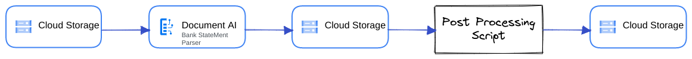

# Purpose and Description

This tool is designed to take bank statements from Google Cloud Storage (GCS) and parse them via a DocAI bank statement processor and post process the response from the parser (post processing as per gatless requirement in project specs) then provide the output in json format.

Below are the steps the tool will follow :

1.Bank statements are parsed through the bank statement processor.
2.Post-processing the response from the bank statement processor and saving the result in json format in the bucket.
3.This scipt includes the option to parse checks for the top three banks, where it is required to train a CDE model.
4.Top Three Banks: WellsFargo, Bank Of America, Chase

</img>

# Input Details
.
* **Project name**: Enter the google cloud project name.
* **Project_Id**: Enter the google cloud project id.
* **Processor_Id**: Enter the bank statement processor id.
* **gcs_input_dir**: Enter the path of files which have to be parsed.
* **gcs_output_dir**: 